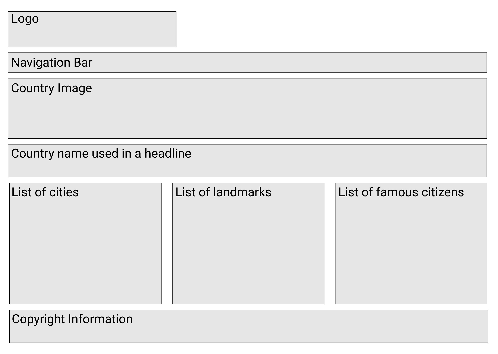

# Automated World

## Goal

Your team is going to build a travel brochure site using javascript automation and include objects, arrays, components, modules, CSS selectors, Flexbox, semantic HTML, and data. Each person should pick a country that you have always wanted to visit and build a page with the following components.

1. Navigation with links to each page. There should be a visual clue for the active page and use the css `hover` pseudo class for all links.
1. A header that includes an appealing image. It could be a city or landmark in that country.
1. The header should also include a headline or sentence promoting travel to the country.
1. A list of cities that you would like to visit in the country. Each city should include the population, short description and a link to an external website for more information. The link should open a new browser tab.
1. A list of landmarks that you would like to visit in the country. Each landmark should have a year created, short description, and a link to an external website for more information. The link should open a new browser tab.
1. A list of famous citizens. For each citizen include their occupation, a short description, and a link to an external website for more information. The link should open a new browser tab.
1. A footer with copyright information and your team information.
1. Use Canva to create a logo for your site. (Timebox this task and spend no more than 15 minutes.)

Each city, each landmark, and each famous citizen must be represented in application state as an object. This means that you will need multiple separate data arrays, list components, and HTML representation components for each page. Share your data with a member of the instruction team.

A suggestion is to create multiple sub-directories under `scripts`. If, for example, your team chose Turkey, Morocco, Tanzania, and Indonesia, you would have the following main modules.

> **Note:** Do not make any properties on your resources that involve presentation - like class names, or HTML tags. Only the properties of the resource should be on each object.

```sh
mkdir scripts/turkey
mkdir scripts/morocco
mkdir scripts/tanzania
mkdir scripts/indonesia

touch scripts/indonesia/main.js
touch scripts/turkey/main.js
touch scripts/morocco/main.js
touch scripts/tanzania/main.js
```

To organize your files even more, you could create three sub-directories in each of the city directories.

```sh
mkdir scripts/morocco/cities
touch scripts/morocco/cities/CityDataProvider.js

mkdir scripts/morocco/landmarks
touch scripts/morocco/landmarks/LandmarkDataProvider.js

mkdir scripts/morocco/celebrities
touch scripts/morocco/celebrities/CelebritiesDataProvider.js
```

## Setup

1. Everyone clone the repository with `git clone {connection string}`
1. Everyone immediately create their first feature branch with `git checkout -b {initials-feature}`

## Requirements

1. Share your data with an instruction team member **before** writing code.
1. Use javascript modules.
1. You must use semantic HTML tags
1. You must use CSS imports
1. You must use good CSS naming conventions, preferably the BEM format
1. You must use Flexbox
1. You have one of your teammates approve a pull request before your branch is merged into `main`.
1. You must do all work on a feature branch, never on `main`.
1. Validate your HTML. Use a tool: [Validator](https://validator.w3.org/)


## User Experience

1. A [style guide](AutoWorld-Styles.pdf) has been provided. Using the style guide, your team must decide on a consistent experience across all pages. Fonts/sizes, color scheme, layout, and structure.


## Stretch Goal
1. Using [Sharethrough](https://headlines.sharethrough.com/), analyze your headline with the country name. Make adjustments to the copy to make it more engaging.

## More Stretch Goal
1. Create a SPA.
